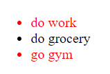

# Frontend Interview Questions

## [HTML/CSS](#html_css) &nbsp;&nbsp;&nbsp; [JavaScript](#js) &nbsp;&nbsp;&nbsp; [React](#react) &nbsp;&nbsp;&nbsp; [General](#general)

### Recommendation: watch <a href="https://www.youtube.com/watch?v=pN6jk0uUrD8&list=PLlasXeu85E9cQ32gLCvAvr9vNaUccPVNP&ab_channel=AkshaySaini">Namaste JavaScript</a> or read my <a href="https://blogs-ssk.netlify.app/">Blogs</a> before proceeding.

## <a id="html_css">HTML/CSS</a>

1. **Differentiate between div & span or block & inline.**

- `Block-level Elements`: A block level element always starts on a new line, and the browsers automatically add some space (margin) before and after the element. A block level element always takes up the full width available (100% of parent). Eg: div, p.

- `Inline Elements`: An inline element does not start on a new line. It takes up minimum space i.e., as much width as necessary. Eg: span

- The `div` element is block level and is often used as a container for other HTML elements.

- The `span` element is an inline container used to mark up a part of text, or document.

- Another important point to note is that an inline element cannot contain a block level element. Block elements can contain inline elements.

- However there are some exceptions to the above rule. Eg, the `a` tag, which is an inline element, can contain block level elements such as `div` or `p` if they are used within the `a` tag as an alternative to `href` attribute. This is known as the `block link` pattern.

- But in general, it is best practice to avoid nesting block level elements inside inline elements to ensure proper HTML structure and to avoid unexpected layout issues.

---

2. **What is inline-block? Difference between block, inline-block, and inline.**

- The three most common values for `display` property are: `block`, `inline-block`, and `inline`.

- `display: block`: Take up the entire space (width: 100%) of the parent by default. We can specify height and width to these elements. These elements always start in a new line. We can apply top and bottom margins.

- `display: inline-block`: Elements don't start in a new line. Their heights and widths can be specified. By default take take minimum space. We can apply top and bottom margins.

- `display: inline`: They don't start in a new line, take minimum space and we cannot apply height and width properties to them. Margin top and bottom doesn't work here.

---

3. **What is SCSS? How is it different from CSS? How does it get transpired to CSS?** <span style="color:yellow">[Flipkart]</span>

- SCSS (Sassy CSS) is a CSS `preprocessor` that adds functionality features to CSS. Differences are listed below:

- SCSS uses the same syntax as CSS, but allows for additinal features like `variables` and `nesting`.

- SCSS allows you to define variables that can be reused throughout your stylesheet, making it easier to maintain and update code.

- SCSS allows you to nest selectors, which can make your code more readable and easier to understand.

- `Mixin`: SCSS allows you to define reusable blocks of CSS code called mixins, which can be included in other parts of your code.

SCSS is not understood by the browser. It must be transpiled into CSS code that the browser can understand. This is typically done using a tool like `Webpack` or `Gulp`. Advantages of PostCSS over SCSS are listed below:

- PostCSS is a tool that processes CSS code and applies transformations to it. unlike SCSS, which is a preprocessor that extends CSS with additional features, PostCSS operates on standard CSS syntax and can be used to automate tasks like adding vendor prefixes, optimizing code, and generating fallbacks for older browsers.

- PostCSS works by using plugins, which are small JS modules that take in CSS code, apply transfromations to it, and output the transformed code.

- One of the key benefits of PostCSS over SCSS is its flexibility. Since it operates on standard CSS syntax, it can be used with any CSS code. This makes it easy to integrate into existing projectsm and it allows you to apply the same transformations to both preprocessed and hand-written CSS code.

- Aditionally, PostCSS can be faster than SCSS because it doesn't require compiling a separate file to generate the final CSS code. Instead, PostCSS operates directly on the CSS code, which can result in faster build times and a more efficient development workflow.

---

4. **What are positions in CSS? Differentiate between them.**

- Positions in CSS are listed below:

- Static: `This is the default position` value for all HTML elements. Elements with a static position are positioned according to the normal document flow, and the top, left, bottom, right and z-index properties have no effect on them.

- Relative: Elements with a relative positoin are positioned `relative to their normal position` in the document flow. You can use the top, right, bottom, and left properties to move them in any direction relative to their original position.

- Absolute: Elements with an absolute position are positioned relative to their closest positioned ancestor. If there is no positioned ancestor, the element is positioned relative to the initial containing block. `Element positioned absolute is taken out of the normal document flow`. This means that other elements will not be affected by its position, and it may overlap with other elements on the page. You can use the top, left, bottom, right properties to postion them relative to their closest positioned ancestor (element with position relative).

- Fixed: Elements with a fixed position are positioned relative to the viewport, and they do not move when the page is scrolled. You can use the top, left, right, and bottom properties to position them relative to the viewport. `Element positioned fixed is taken out of the normal document flow`.

- Sticky: Elements with a sticky position are positioned based on the user's scroll position. They behave like a combination of `relative` and `fixed` positioning. They start out in the normal document flow (relative), but they become `fixed` once the user has scrolled to a certain point. You can use the top, left, bottom, and right properties to set the sticky position.

- Inherit: Elements with an inherit position will inherit the position value of their parent element. If the parent element does not have a position value set, the element will be `static`

- `Relative vs Absolute`: Element positioned absolute is taken out of the normal document flow. This means that other elements will not be affected by its position, and it may overlap with other elements on the page. In contrast, element with relative positioning is still in the normal document flow and will occupy space, and other elements will be affected by its position. Another difference is that element positioned absolute will be positioned wrt it's nearest parent having position relative or the html element if none of its parents are positioned relative. Elements positioned relative will be positioned wrt to its own original position when properties like top, bottom, left, and right are used on it.

- `Fixed vs Sticky`: Element positioned fixed remains in the same position relative to the viewport and is taken out of the normal document flow from the beginning. Element positioned sticky is a combination of relative and fixed position. Initially, sticky element behaves like an element positioned relative. As soon as the user scrolls and the element is about to be out of view, the sticky element behaves like fixed element.

- `Absolute vs Fixed`: Element positioned absolute is positioned relative to its nearest parent having position relative or html in case there are no parents with position relative. Elements positoined fixed are positioned wrt the viewport. This means that element positoined fixed will remain in view, no matter how much we scroll down the page, in the exact same position. But the element positioned absolute will not be visible to us once we scroll down enough.

---

5. **Explain CSS Specificity.**
   <span style="color:yellow">[Flipkart]</span>

- In CSS, specificity is the measure of how specific a selector is in selecting an element or group of elements on a web page. Specificity is determined by the number and type of selectors used in the CSS rule, `and it determines which CSS rule is applied to an element when multiple rules target the same element`.

- Each `id` selector increases the specificity by `100`. Each `class/ attribute/ pseudo class` selector increases specificity by `10`. Each `tag/ element` selector increases the specificity by `1`. CSS rule having the highest specificity is applied to the concerned element.

- Precedence order: !important > inline-css > id > class > tag.

- <a href="https://blogs-ssk.netlify.app/css-specificity">More</a>

---

6. **What is the difference between Reset CSS and Normalize CSS?**

- By default, different web browsers may have slightly different styles for HTML elements like headings, paragraphs, lists, and links. This can make it difficult to create consistent styles across different browsers.

- `Reset CSS` resets all the styles for all HTML elements to a consistent baseline. This means that developers need to define all styles for all elements. It is a good choice for developers who want complete control over the styles of all elements.

- `Normalize CSS` is a more conservative approach that poreserves some of the default styles for HTML elements while normalizing others. It provides a set of CSS rules that make HTML elements consistent across different browsers, but still allows developers to define their own styles without having to completely redefine every element. It is a good choice for developers who want a more consistent baseline of styles without having to start from scratch.

- The infamous three lines actually comes under CSS Reset.

```css
* {
  margin: 0;
  padding: 0;
  box-sizing: border-box;
}
```

---

7. **Why are meta tags used? What are the meta tags you know?**

- Meta tags are used in HTML to provide additional information about a web page to search engines, social media platforms, and web browsers. They help in `Search Engine Optimization`. They are placed in the head section of an HTML document and are not visible on the web page itself. Some common meta tags are listed below:

- `<meta charset="utf-8">`: Specifies the character encoding of the HTML document.

- `<meta name="viewport" content="width=device-width, initial-scale=1.0">`: Sets the viewport width and initial zoom level for mobile devices.

- `<meta name="description" content="...">`: Provides a short description of the web page that can be displayed in search engine results.

- `<meta name="keywords" content="...">`: Specifies the keywords or phrases that the web apge is related to.

- `<meta name="robots" content="...">`: Instructs search engines how to crawl and index the web page.

- `<meta name="author" content="...">`: Specifies the author of the web page.

- `meta name="theme-color" content="..."`: Sets the color of the browser toolbar and browsers's UI when the user is on the web page.

---

8. **How can you improve SEO just by HTML tags?**

- `Use relevant and descriptive title tags`: The title tag is one of the most important HTML tags for SEO. Make sure your title tag accurately reflects the content of your page and includes your target keywords.

- `Use header tags to structure your content`: Header tags help to organize content and make it more readable. Use header tags to break your content into logical sections and include your target keywords in the headings.

- `Use meta descriptions to provide a summary of your content`: Meta descriptions appear in search engine results and can help to improve click-through rates.

- `Use alt tag to describe your images`: Alt tags are used to describe images for people with visual impairments and for search engines.

- `Do not used span and div tags everywhere`: Use Semantic HTML wherever possible

---

9. **Explain the box model in CSS.**
   <span style="color:yellow">[Flipkart]</span>

- The box model has four parts: `Content` `Padding` `Border` `Margin`

- `Content`: This is the actual content.

- `Padding`: This is the space between the content and the border of the box.

- `Border`: This is a line that surrounds the padding and content of the box.

- `Margin`: This is the space between the border of the box and the neighbouring elements on the page.

---

10. **Explain box-sizing property in CSS.**
    <span style="color:yellow">[Flipkart]</span>

- The `box-sizing` property controls how the `total size of an element is calculated`, including its content, padding, and border. The possible values for box-sizing are:

- `content-box`: This is the default value. It tells the browser to `calculate the size of an element based on its content only, without including padding or border`. In other words, the size of an element is determined by the width and height properties.

- `border-box`: It tells the browser to calculate the size of an element based on `its content, padding, and border`. In other words, the width and height properties specify the size of the content area, and the padding and border are added to it. This is more convenient because it lets us set the width and height of an element without having to take into account the padding and border.

---

11. **Differentiate between local storage, session storage, and cookies.**

- `Local Storage`: It is a key value storage that allows you to store data in a user's browser without an expiration date. This means that the data stored in local storage persists even after the browser is closed or the computer is restarted. The data is specific to a domain and can be accessed by scripts from that domain.

- `Session Storage`: Data stored in sessionStorage is tied to a specific session. THis means that the data is lost when the browser is closed. The data is specific to a domain and can only be accessed by scripts from that domain.

- `Cookies`: Cookies are small pieces of data that are stored in a user's browser and are sent to the server with each request. Cookies can be used to store data that persists across multiple sessions or to track user behavior. Cookies have an expiration date, and their lifespan can be set by the server.

---

12. **What's the difference between opacity:0, visibility:hidden, and display:none ?**

- `opacity:0` : this will make the element transparent. You cannot see it, but you can interact with it. It takes up space.

- `visibllity:hidden`: this is a combination of opacity:0 and pointer-events:none. In other words, you cannot see it or interact with it. However, it takes up space.

- `display:none`: this removes the element from the layout, hence the element doesn't take up space. You cannot see it or iteract with it.

| opacity:0                        | visibility:hidden                | display:none                         |
| -------------------------------- | -------------------------------- | ------------------------------------ |
| element takes up space           | element takes up sapce           | element doesn't take any space       |
| element is interactable          | element is not interactable      | element is not interactable          |
| element is present in the layout | element is present in the layout | element is not present in the layout |

---

13. **Create a triangle in CSS**

```css
div {
  box-sizing: border-box;
  margin-left: 45%;
  height: 0;
  width: 0;
  border-top: 5rem solid transparent;
  border-bottom: 5rem solid transparent;
  border-right: 5rem solid yellow;
  rotate: 90deg;
}
```

---

14. **Create a 5 \* 5 chess board using HTML & CSS**
    <span style="color:yellow">[Thinkify]</span>

```html
<div class="board">
  <div class="box"></div>
  <div class="box"></div>
  <div class="box"></div>
  <div class="box"></div>
  <div class="box"></div>
  <div class="box"></div>
  <div class="box"></div>
  <div class="box"></div>
  <div class="box"></div>
  <div class="box"></div>
  <div class="box"></div>
  <div class="box"></div>
  <div class="box"></div>
  <div class="box"></div>
  <div class="box"></div>
  <div class="box"></div>
  <div class="box"></div>
  <div class="box"></div>
  <div class="box"></div>
  <div class="box"></div>
  <div class="box"></div>
  <div class="box"></div>
  <div class="box"></div>
  <div class="box"></div>
  <div class="box"></div>
</div>
```

```css
* {
  margin: 0;
  padding: 0;
  box-sizing: border-box;
}

body {
  height: 100dvh;
  display: flex;
  justify-content: center;
  align-items: center;
}

.board {
  display: grid;
  grid-template-columns: repeat(5, 1fr);
  grid-template-rows: repeat(5, 1fr);
}

.box {
  width: 10vmin;
  height: 10vmin;
  border: 1px solid black;
}

.box:nth-child(even) {
  background-color: black;
}
```

---

## <a id="js">JavaScript</a>

1. **Differentiate between let, var, and const.**

- `Scope`: let and const are block scoped, while var is function scoped.

```javascript
for (var i = 1; i < 4; i++) {
  setTimeout(() => {
    console.log(i);
  }, 1000);
}
// Output: 4 4 4
```

```javascript
for (let i = 1; i < 4; i++) {
  setTimeout(() => {
    console.log(i);
  }, 1000);
}
// Output: 1 2 3
```

- `Hoisting`: all the three are `hoisted`. However, `let` and `const` are in a `temporal dead zone`. This means that JavaScript acknowledges its presence by providing it with the value `undefined`, but `won't let us use it`. We would be getting the value `undefined` when we access var before its declaration. <a href="https://blogs-ssk.netlify.app/js-hoisting-let&const">More</a>

```javascript
console.log(a);
var a; // undefined
```

```javascript
console.log(b); // ReferenceError: b is not defined
let b;
```

```javascript
console.log(c); // ReferenceError: c is not defined
const c = 30;
```

- `Global Object`: var gets attached to the global object when declared in the global space, while let and const do not get attached to the global space.

```javascript
var a = 10;
let b = 20;
const c = 30;

console.log(a); // 10
console.log(b); // 20
console.log(c); // 30

console.log(this.a); // 10
console.log(this.b); // undefined
console.log(this.c); // undefined

console.log(window.a); // 10
console.log(window.b); // undefined
console.log(window.c); // undefined
```

- `Re-declaration`: we can re-declare var in the same scope with the same variable name. This is not possible with let and const.

```javascript
var a = 10;
var a = 20;
console.log(a);

let b = 10;
let b = 20; // SyntaxError: Identifier 'b' has already been declared

const c = 10;
const c = 20; // SyntaxError: Identifier 'c' has already been declared
```

- `Update`: we can update the values in case of var and let, but in case of const it is not possible.

```javascript
var a = 10;
a = 20;
console.log(a); // 20

let b = 10;
b = 20;
console.log(b); // 20

const c = 10;
c = 20; // TypeError: assignment to constant variable.
```

- `Initialization`: in case of const, we've to initialize the variable in the same line where it is declared. var and let can be initialized later.

```javascript
var a;
a = 10; // 10

let b;
b = 10; // 10

const c;
c = 10; // SyntaxError: Missing initializer in const declaration
```

- `Shadowing`: When we have the same variable name in different places, the value of the variable closest to the line of execution is chosen. This phenomenon is called shadowing. <a href="https://blogs-ssk.netlify.app/js-block&shadowing">More</a>

```javascript
var a = 10;
const b = 20;
let c = 30;

{
  var a = 100;
  const b = 200;
  let c = 300;
  console.log(a); // 100
  console.log(b); // 200
  console.log(c); // 300
}

console.log(a); // 100
console.log(b); // 20
console.log(c); // 30
```

- In case of var, shadowing is permanent. This is because var is function scoped and gets attached to the global object. So a variable having the same name within a block and outside would point to the same location in the global object.

- var can be used to shadow let and const, but let or const cannot be used to shadow var. This is because var is not block scoped. Hence it exists outside the block as well and we know from above that let and const cannot have same variable name redeclared in the same scope.

```javascript
var a = 10;
{
  let a = 20;
  console.log(a); // 20
}
console.log(a); // 10
```

```javascript
let a = 10;
{
  var a = 20; // SyntaxError: Identifier 'a' has already been declared
}
```

---

2. **What is a Promise? What is Promsie Chain?**
   <span style="color:yellow">[Flipkart]</span>

`Promise`

- A promise is an object that represents the eventual completion or failure of an asynchronous operation. Essentially, a promise is an object returned by an async operation to which we attach callbacks instead of passing the callback to another function.

The promise object has three states: `Pending`, `Fulfilled`, and `Rejected`.

- `Pending`: The initial state of a Promise before it has been resolved or rejected.

- `Fulfilled`: The state of a Promise when it has been resolved, meaning that the value it represents is now available.

- `Rejected`: The state of a Promise when it has been rejected, meaning that an error has occured and the value it represents is not available.

A promise has two important methods:

- `then()`: This method is used to handle the fulfullment of a Promise. It takes two arguments: a callback function that will be executed when the Promise is resolved, and an optional callback function that will be executed if the promise is rejected.

- `catch()`: This method is used to handle the rejection of a Promise. It takes one argument: a callback function that will be executed if the Promise is rejected.

```javascript
function fetchData() {
  return fetch("https://example.com/data")
    .then((response) => {
      if (!response.ok) {
        throw new Error("Network error");
      }
      return response.json();
    })
    .catch((error) => {
      switch (error.message) {
        case "Network error":
          console.log("There was a network error");
          break;
        case "JSON parse error":
          console.log("There was a problem parsing the JSON data");
          break;
        default:
          console.log("An unknown error occured");
      }
    });
}
```

Advantages of promises:

- Promise is immutable. So there is no possibility of altering the data we received from an asynchronous event.
- Promise allows us to avoid `inversion of control` and `pyramid of doom`.

- First we have to understand that before promises, people used to pass callbacks to another function in order to perform async operations. This caused `inversion of control` and `pyramid of doom`.

- `Inversion of Control`: When we pass a function to another function as callback, the function passed as callback is completely at the mercy of the function to which it is passed. We cannot call the callback function directly. Hence we lose control over a certain portion of our code. This situation is known as inversion of control. While using promises, we have the `then()` which resolves this issue.

- `Pyramid of Doom`: Also known as `callback hell`, this happens when we chain too many interdependent async operations. There will be callback inside a function, the callback will have another callback, and this continues. This results in the code growing horizontally instead of vertical, and this structure is known as the Pyramid of Doom.

`Promise Chain`

- A Promise Chain is a sequence of asynchronous operations that are executed one after the other, with each operation waiting for the previous one to complete before starting.

```javascript
function promiseChain(data) {
  operation1(data)
    .then((data2) => {
      return operation2(data2);
    })
    .catch((error) => {
      console.log(error.message);
    })
    .then((data3) => {
      return operation3(data3);
    })
    .catch((error) => {
      console.log(error.message);
    });
}
```

---

3. **Output Questions**

```javascript
function promisify(number, increase) {
  return new Promise((resolve) =>
    setTimeout(() => resolve(number * 2 + increase), 100)
  );
}

async function double(number, increase) {
  const value = await promisify(number, increase);
  return value;
}

async function run() {
  let result;
  result = await double(5, 0);
  result = await double(10, result);
  result = await double(20, result);
  console.log(result);
}
run();

// Output: 70
```

```javascript
for (var i = 1; i <= 3; i++) {
  (function (index) {
    setTimeout(function () {
      console.log(index);
    }, i * 1000);
  })(i);
}

// Output: 1 2 3
```

```javascript
for (var i = 1; i <= 3; i++) {
  setTimeout(function () {
    console.log(i);
  }, i * 1000);
}

// Output: 4 4 4
```

```javascript
for (var i = 1, j = 1; i <= 3; i++, j++) {
  setTimeout(
    function () {
      console.log(this);
    }.bind(i),
    j * 100
  );
}

// Output: Number {1} Number {2} Number {3}
```

```javascript
let x = true;
let count = 0;
setTimeout(() => {
  x = false;
}, 2000);

while (1) {
  if (x) {
    count++;
    console.log(count);
  }
}

// Output: infinite loop
/* JS is a single threaded language. The while loop will block the
callstack and the setTimeout will remain in the callback queue, starving
to be put to the callstack for execution.
```

---

4. **If there are two functions to be executed, one is a returned promise and the other is a function inside the setTimeout. Which will be executed first given the call stack is busy and both are ready to be executed when the call stack becomes free?**

- The `promise` will be given `priority` over the `setTimeout` function. In JavaScript, the event loop is responsible for managing the call stack, callback queue and the microtask queue. Promises and operations from mutation observer go to the microtask queue while all other asynchronous operations are passed to the callback queue till they're ready to be executed in the callstack.

- The event loop keeps on monitoring all three: callstack, callback queue, and the microtask queue. If there is something waiting in the callback queue or the microtask queue to be executed, it is the event loop which checks if the callstack is free and then it pushes the pending task of the callback/ microtask queue to the callstack. Everything in JS is executed inside the callstack.

- Now it is given to us that the call stack was busy and the promise has been brought to the microtask queue and the setTimeout function has been brought to the callback queue. `Microtask queue has higher priority than the callback queue`. Hence the event loop picks up the promise and sends it to the callstack, hence it is executed first. After that, the callback from setTimeout is executed.

---

5. **What is the `this` keyword in JavaScript?**
   <span style="color:yellow">[Thinkify]</span>

- The `this` keyword in JavaScript referes to the object that is currently executing the code. At the global level, this points to the global object, which is `window` in case of browsers.

```javascript
console.log(this === window); // true
```

```javascript
function check() {
  console.log(this === window); // true
}

check();
```

```javascript
class Check {
  constructor() {
    console.log(this === window); // false
  }
}

const checker = new Check();
```

`When this appears inside a function that is not bound to any object or class, the value of this defaults to the global object, when not using strict mode.`.

---

6. **What are the call, bind, and apply methods in JavaScript? Differentiate between them.**
   <span style="color:yellow">[Flipkart]</span>

- `call` `bind` and `apply` are used to manipulate the `this` keyword and pass arguments to functions in different ways.

- Whenever we call a function, by default js behind the scene uses the `call` method. When we have a function defined inside an object, and we want to reuse the function inside that object in another object, we use `call` `bind` and `apply`.

- `call` and `apply` **invoke the function immediately**, while **bind returns a function that can be invoked later**.

```javascript
function helloWorld() {
  console.log("Hello World");
}

helloWorld();
helloWorld.call();
helloWorld.apply();

// the above three lines will log the same output.
// JS by default uses .call() to call a function.
```

```javascript
let participant1 = {
  name: "John",
  battery: 70,
  chargeBattery: function () {
    this.battery = 100;
  },
};

let participant2 = {
  name: "Doe",
  battery: 30,
};

console.log(participant1.battery); // 70
participant1.chargeBattery();
console.log(participant1.battery); // 100

console.log(participant2.battery); // 30
participant1.chargeBattery.call(participant2);
console.log(participant2.battery); // 100
```

```javascript
let participant1 = {
  name: "John",
  battery: 70,
  chargeBattery: function (p1, p2) {
    this.battery = this.battery + p1 + p2;
  },
};

let participant2 = {
  name: "Doe",
  battery: 30,
};

console.log(participant2.battery); // 30
participant1.chargeBattery.call(participant2, 10, 20);
console.log(participant2.battery); // 60
```

- While using the `call` method, the first argument is `this`, followed by `n arguments`.

```javascript
let participant1 = {
  name: "John",
  battery: 70,
  chargeBattery: function (p1, p2) {
    this.battery = this.battery + p1 + p2;
  },
};

let participant2 = {
  name: "Doe",
  battery: 30,
};

console.log(participant2.battery); // 30
participant1.chargeBattery.apply(participant2, [10, 20]);
console.log(participant2.battery); // 60
```

- While using the `apply` method, the first argument is `this`, `followed by an array of n arguments`.

```javascript
let participant1 = {
  name: "John",
  battery: 70,
  chargeBattery: function (p1, p2) {
    this.battery = this.battery + p1 + p2;
  },
};

let participant2 = {
  name: "Doe",
  battery: 30,
};

let participant3 = {
  name: "Sally",
  battery: 25,
};

console.log(participant2.battery); // 30
const newBattery2 = participant1.chargeBattery.bind(participant2, 10, 20);
newBattery2();
console.log(participant2.battery); // 60

console.log(participant3.battery); // 25
const newBattery3 = participant1.chargeBattery.bind(participant3, ...[10, 20]);
newBattery3();
console.log(participant3.battery); // 55
```

- `bind` returns a function that can be invoked later instead of invoking the function immediately. The first parameter is `this`, followed by `n arguments`. However, we can also pass an `array of n arguments preceeded by spread operator` as shown in the example above.

- Differences are listed below:

- `call` and `apply` invoke the function immediately, while `bind` returns a function that can be invoked later.

- `call` has second argument as `n parameters`, `apply` has second argument as `array of n parameters`.

---

7. **What is polyfill in JavaScript? Write polyfill for call, bind, and apply.**

- Polyfill is a piece of code that provides functionality that is not natively available in the current version of a browser or JS engine. Polyfills are commonly used to implement new web standards or features that have been added to JS but are not yet widely supported by all web browsers. For example, if a new JavaScript method is introduced in the latest version of the language, but older browsers do not support it, a polyfill can be written to add support for the new method in those older browsers.

**Polyfill for bind**

```javascript
const obj = {
  a: 10,
  b: 20,
};

function test(a, b) {
  console.log(`${this.a} ${this.b} | ${a} ${b}`);
}

// Polyfill
Function.prototype.myBind = function (obj, ...args) {
  obj.property = this; // this here is test
  return () => obj.property(...args);
};

const mb = test.myBind(obj, 40, 50);
mb(); // 10 20 | 40 50

//Original bind
const og = test.bind(obj, 4, 5);
og(); // 10 20 | 4 5
```

**Polyfill for call**

```javascript
const obj = {
  a: 10,
  b: 20,
};

function test(a, b) {
  console.log(`${this.a} ${this.b} || ${a} ${b}`);
}

Function.prototype.myCall = function (obj, ...args) {
  obj.property = this;
  return obj.property(...args);
};

// myCall
test.myCall(obj, 6, 9); // 10 20 | 6 9

// Original call
test.call(obj, 5, 10); // 10 20 | 5 10
```

**Polyfill for apply**

```javascript
const obj = {
  a: 10,
  b: 20,
};

function test(a, b) {
  console.log(`${this.a} ${this.b} || ${a} ${b}`);
}

Function.prototype.myApply = function (obj, args) {
  obj.property = this;
  return obj.property(...args);
};

// myApply
test.myApply(obj, [6, 9]);

// Original apply
test.apply(obj, [5, 10]);
```

---

8. **What are generator functions in JavaScript?**

- `Generators are functoins that can be exited and later re-entered.` Their context will be saved across re-entrances.

```javascript
function* simpleGenerator() {
  yield 1;
  yield 2;
  yield 3;
}

const generatorObject = simpleGenerator();
console.log(generatorObject.next()); // {value: 1, done: false}
console.log(generatorObject.next()); // {value: 2, done: false}
console.log(generatorObject.next()); // {value: 3, done: false}
console.log(generatorObject.next()); // {value: undefined, done: true}
console.log(generatorObject.next()); // {value: undefined, done: true} ...
```

- `yield` is like a special type of return that is only useful inside of a generator. That is because the purpose of the generator is to run some code, then return a value, then run some more code, repeating the process till the entire code inside the generater has been executed.

- Every generator object has access to a function called `next()` that allows us to execute the code inside the generator until a yield statement has been approached. As we come across a `yield` statement, the function is exited.

- The generator object has two things, `value` and `done`. `value` is what is yielded by the generator and done implies whether entire code inside the generator has been executed.

- Some uses of generators are as follows:

**To generate an infinite loop**

```javascript
function* infiniteLoop() {
  let id = 1;
  while (true) {
    yield id;
    id++;
  }
}

const id = infiniteLoop();
console.log(id.next()); // {value: 1, done: false}
console.log(id.next()); // {value: 2, done: false}
```

**Using generator as an iterator**

```javascript
function* iterator(array) {
  for (let i = 0; i < array.length; i++) {
    yield array[i];
  }
}

const arrayIterator = iterator([1, 2, 3]);
console.log(arrayIterator.next().value); // 1
console.log(arrayIterator.next().value); // 2
```

---

9. **What is closure in JavaScript?**
   <span style="color:yellow">[Thinkify, Flipkart, Landmark Group]</span>

- Function along with its lexical environment is known as closure. Lexical environment is the local memory plus the lexical environment of the parent.

```javascript
function a() {
  const b = 10;
  return function () {
    console.log(b);
  };
}

const x = a();
x(); // 10
```

- Whenever a function is returned, it maintains its lexical environment. That is why we are able to access the variables declared inside its lexical environment even after the execution context of the function has been destroyed.

---

10. **Explain event loop in JavaScript.**
    <span style="color:yellow">[Flipkart]</span>

- JavaScript is a synchronous single threaded language. It has one `call stack` inside which the code is executed, and it can perform only one task at a time.

- All the asynchronous activities in JS is taken out of call stack and once finished, is put into one of these two queues: `callback queue` or `microtask queue`.

- All the callback functions that come through promises and mutation observer go into the microtask queue. All other callbacks are pushed to the callback queue.

- The event loop is keeps a track of the `callstack`, `callback queue`, and the `microtask queue`. If it finds callbacks inside `callback queue` or `microtask queue` ready to be executed, it checks if the callstack is empty or not. As soon as the callstack is empty, the `event loop` is responsible for moving the callbacks from these two queues to the callstack, where they're finally executed.

- One point to note here is that the microtask queue has higher priority than the callback queue. Hence if there are two callbacks, each in one of the two queues and the callstack is empty, the event loop will prioritize the callback in the microtask queue and push it to the callstack first.

---

11. **Explain Promise.all().**
    <span style="color:yellow">[Thinkify]</span>

- `Promise.all()` is a built in JavaScript method that accepts an array of promises and returns a new promise. `Promise.all()` will wait for all the promises in the input array to be resolved before resolving the resulting promise it returns. If any of the input promises reject, the resulting promise returned by `Promise.all()` will also reject immediately.

```javascript
const p1 = new Promise((resolve) => setTimeout(() => resolve(1), 1000));
const p2 = new Promise((resolve) => setTimeout(() => resolve(2), 2000));
const p3 = new Promise((resolve) => setTimeout(() => resolve(3), 3000));

Promise.all([p1, p2, p3]).then((value) => console.log(value)); // [1, 2, 3] after 3s
```

---

12. **Write polyfills for map, filter and reduce**.

**Map**

```javascript
Array.prototype.myMap = function (cb) {
  const result = [];
  for (let i = 0; i < this.length; i++) {
    result.push(cb(this[i], i, this));
  }
  return result;
};

console.log([1, 2, 3].myMap((n) => n * n));
```

**Filter**

```javascript
Array.prototype.myFilter = function (cb) {
  const result = [];
  for (let i = 0; i < this.length; i++) {
    if (cb(this[i], i, this)) {
      result.push(this[i]);
    }
  }
  return result;
};

console.log([1, 2, 3, 4, 5, 6].myFilter((n) => n % 2 === 0));
```

**Reduce**

```javascript
Array.prototype.myReduce = function (cb, initial) {
  let accumulator = initial ?? this[0];
  for (let i = 0; i < this.length; i++) {
    accumulator = cb(accumulator, this[i], i, this);
  }

  return accumulator;
};

console.log([1, 2, 3].myReduce((total, n) => total + n, 0));
```

---

13. **Differentiate between map and forEach. Also write similarity.**

**Difference**

- map returns a new array, while forEach doesn't return anything.

- since map returns a new array, we can change other array methods to the result of a map. This is not possible in case of forEach.

**Similarity**

- both map and forEach are higher order functions.

- `both map and forEach don't change the original array`. many people say that forEach can change the original array but map cannot. Well they use the callback function passed to change the array. Even map can change the original array in that way.

```javascript
const arr1 = [1, 2, 3];
const arr2 = [1, 2, 3];

// map
arr1.map((n) => n * n);
console.log(arr1); // [1, 2, 3]
arr1.map((n, i, ar) => (ar[i] = n * n));
console.log(arr1); // [1, 4, 9]

// forEach
arr2.forEach((n) => n * n);
console.log(arr2); // [1, 2, 3]
arr2.forEach((n, i, ar) => (ar[i] = n * n));
console.log(arr2); // [1, 4, 9]
```

---

14. **Problems based on map, filter, and reduce**

```javascript
let students = [
  { name: "Piyush", rollNumber: 31, marks: 80 },
  { name: "Jenny", rollNumber: 15, marks: 69 },
  { name: "Kaushal", rollNumber: 16, marks: 35 },
  { name: "Dilpreet", rollNumber: 7, marks: 55 },
];

// return only names in caps
const capitalizedNamesOnly = students.map((student) =>
  student.name.toUpperCase()
);

// return details of students who scored more than 60 marks
const greaterThanSixty = students.filter((student) => student.marks > 60);

// return sum of marks of all the students
const marksSum = students.reduce((total, student) => total + student.marks, 0);

// return names of students who scored more than 60
const namesGreaterThanSixty = students
  .filter((student) => student.marks > 60)
  .map((student) => student.name);

// return total marks for students with marks greater than 60 after 20 marks have been added to those who scored less than 60
const misc = students
  .map((student) => (student.marks < 60 ? student.marks + 20 : student.marks))
  .filter((mark) => mark > 60)
  .reduce((total, mark) => total + mark, 0);
```

---

15. **Give an example of private function in JavaScript**

```javascript
class BankAccount {
  name = "John Doe";
  #accNo = 12345;
  #pin = 6969;
  #balance = "10000";

  #isUserAuthorized(accNo, pin) {
    return accNo === this.#accNo && pin === this.#pin;
  }

  getBalance(accNo, pin) {
    if (this.#isUserAuthorized(accNo, pin)) return this.#balance;
    return "Not Authorized";
  }
}

const acc = new BankAccount();
console.log(acc.getBalance(12345, 6969)); // 10000
console.log(acc.getBalance(1, 2)); // Not Authorized
```

---

16. **Give code example of getters and setters in JavaScript**

```javascript
class Student {
  #name;
  #rollNo;

  constructor(name, rollNo) {
    this.#name = name;
    this.#rollNo = rollNo;
  }

  getName() {
    return this.#name;
  }

  setName(name) {
    this.#name = name;
  }

  getRollNo() {
    return this.#rollNo;
  }

  setRollNo(rollNo) {
    this.#rollNo = rollNo;
  }

  getDetails() {
    return [this.#name, this.#rollNo];
  }
}

const s1 = new Student();
const s2 = new Student("Sally Taylor", 16);

console.log(s1); // {#name: undefined, #rollNo: undefined}
console.log(s2); // {#name: 'Sally Taylor', #rollNo: 16}

s1.setName("John Doe");
s1.setRollNo(168);

console.log(s1.getName()); // John Doe
console.log(s1.getRollNo()); // 168
console.log(s1.getDetails()); // ['John Doe', 168]
```

17. **Deep cloning vs Shallow cloning in JavaScript.**
    <span style="color:yellow">[Flipkart]</span>

```javascript
const obj1 = { a: 10, b: 20 };
const obj2 = { a: 100, b: 200 };

const clone1 = obj1; // Shallow Clone
const clone2 = { ...obj2 }; // Deep Clone

console.log(clone1); // {a: 10, b: 20}
console.log(clone2); // {a: 100, b: 200}

clone1.a = 20;
console.log(clone1); // {a: 20, b: 20}
console.log(obj1); // {a: 20, b: 20}

clone2.a = 69;
console.log(clone2); // {a: 69, b: 200}
console.log(obj2); // {a: 100, b: 200}
```

Shallow clone merely points to the original object's location.
Deep clone creates a new object with same values.

---

18. **How to know if a browser can execute JavaScript**.

```html
<noscript>Your browser does not support JavaScript!</noscript>
```

The content inside the `noscript` tag will only be displayed if the browser does not support JavaScript, or if the user has disabled it.

---

19. **What is strict mode in JavaScript?**

- Strict mode in JavaScript is a way to enforce stricter rules and best practices in code, which can help catch common coding mistakes and prevent certain types of bugs.

- For example, strict mode disables the use of undeclared variables.

- By default modern browsers including chrome run javascript in strict mode. When you use a developer console to run code, please note that it doesn’t use strict by default.

**Checking if JS is in strict mode or not**

```javascript
(function () {
  console.log(this);
})();
```

The above code will log `undefined` if in strict mode, else `window` in case of browsers.

**Adding strict mode manually**

```javascript
"use strict";
(function () {
  console.log(this); // undefined
})();
```

---

20. **Output based questions**

```javascript
var a = 10;
var b;
console.log(a); // 10
console.log(b); // undefined
function display() {
  var x = 5;
  console.log(x);
}
display(); // 5
```

```javascript
console.log(a); // undefined
console.log(b); // undefined
display(); // 5
var a = 10;
var b;
function display() {
  var x = 5;
  console.log(x);
}
display(); // 5
```

```javascript
console.log(a);
console.log(b);
var a = 10;
function display() {
  var x = 5;
  console.log(x);
}
console.log(a);

// ReferenceError: b is not defined
```

```javascript
console.log(5 < 6 < 7); // true
console.log(7 > 6 > 5); // false

// becase true < 7 is true but true > 7 is false.
```

```javascript
function add(a) {
  return function (b) {
    return function (c) {
      return a + b + c;
    };
  };
}
console.log(add(1)(4)(3)); // 8
```

```javascript
console.log("start");

const promise1 = new Promise((resolve, reject) => {
  console.log(1);
  resolve(2);
});

promise1.then((res) => {
  console.log(res);
});

console.log("end");

// Output
`start``1``end``2`;
```

```javascript
const obj = {
  a: 1,
  b: 2,
  c: 3,
};

const obj2 = {
  ...obj,
  a: 0,
};

console.log(obj2.a, obj2.b); // 0 2
```

---

21. **What is prototype and prototypal inheritance?**
    <span style="color:yellow">[Flipkart]</span>

- In JavaScript, every object has a prototype object, which is either null or another object. _The prototype object is essentially a blueprint for creating new objects that share common functionality._

- **When a new object is created in JavaScript, it autmatically inherits properties and methods of its prototype object. This is known as `prototypal inheritance`.**

- When a property or method is accessed on an object, JavaScript first looks for that property or method on the object itself. If it is not found, JS looks for it on the object's prototype, and then on the prototype's prototype, and so on until it is found or until the end of the prototype chain is reached.

```javascript
const obj = {
  a: 10,
  b: 20,
};

obj.__proto__ = { a: 15, b: 30, c: 45 };
console.log(obj.c); // 45

// This is just a demonstration, it's not a good practice!
```

---

22. **Implement debounce and throttle in JavaScript**

**Debounce**

```javascript
function debounce(cb, delay) {
  let timer;
  return (...args) => {
    clearTimeout(timer);
    timer = setTimeout(() => {
      cb(...args);
    }, delay);
  };
}
```

**Throttle**

```javascript
function throttle(cb, delay) {
  let firstTime = true;
  return (...args) => {
    if (firstTime) {
      cb(...args);
      firstTime = false;
      setTimeout(() => {
        firstTime = true;
      }, delay);
    }
  };
}
```

---

23. **What is currying in JavaScript?**

- Currying is a technique to transform a function that takes multiple arguments into a sequence of functions that takes one or more than one arguments. The curried functions can be called one after another to gradually build up the original function's arguments.

**Currying using bind**

```javascript
function multiply(x, y) {
  console.log(x * y);
}

const multiplyByTwo = multiply.bind(this, 2);
multiplyByTwo(5); // 10

const multiplyByThree = multiply.bind(this, 3);
multiplyByThree(5); // 15
```

**Currying using closure**

```javascript
function multiply(x) {
  return function (y) {
    console.log(x * y);
  };
}

const multiplyByTwo = multiply(2);
multiplyByTwo(5); // 10

const multiplyByThree = multiply(3);
multiplyByThree(5); // 15
```

---

24. **Given an array of numbers. Return an array that has at max 2 same numbers, if any. Example:**

_Input: [1,1,1,2,2,2,3,3,3,4] Output: [1,1,2,2,3,3,4]_

```javascript
const arr = [1, 1, 1, 2, 2, 2, 3, 3, 3, 4];
const map = new Map();

const output = arr.reduce((acc, num) => {
  let freq = map.get(num) ?? 0;
  if (freq < 2) {
    acc.push(num);
    map.set(num, freq + 1);
  }

  return acc;
}, []);

console.log(output);
```

---

25. **Given an array of numbers. Return an object having numbers as keys and their frequency as values.**

```javascript
const arr = [1, 1, 1, 2, 2, 2, 3, 3, 3, 4];

const output = arr.reduce((acc, num) => {
  if (acc.has(num)) {
    acc.set(num, acc.get(num) + 1);
  } else {
    acc.set(num, 1);
  }

  return acc;
}, new Map());

console.log(output); // {1 => 3, 2 => 3, 3 => 3, 4 => 1}
```

---

26. **Given an array. Flatten it.**

```javascript
const arr = [1, [1, 2, [1, [1], 2], 3], 3, 4];

function flattenArray(arr) {
  return arr.reduce((acc, num) => {
    return Array.isArray(num) ? acc.concat(flattenArray(num)) : acc.concat(num);
  }, []);
}

console.log(flattenArray(arr)); // [1, 1, 2, 1, 1, 2, 3, 3, 4]
```

---

27. **Name some functional programming concepts that you use.**

- `Pure functions`: A pure function is a function that always returns the same output for a given input and has no side effects. It does not modify any variables outside of its scope and doesn't rely on variables outside of its scope.

```javascript
function sum(a, b) {
  return a + b;
}
```

- `Immutability`: Immutability means data tha cannot be changed once it has been created. Instead of modifying an existing object, new objects are created with the desired changes.

- `Higher Order Functions`: A higher order function is one which takes another function as argument, or returns another function, or both. Eg: `map`, `filter`, `reduce`.

---

28. **What are the different datatypes in JavaScript?**

- There are `8` basic data types in JavaScript:

- `number`, `string`, `boolean`, `null`, `undefined`, `symbol`, `object`, `bigint`.

---

29. **What is the difference between null and undefined?**

| null                                                         | undefined                                                        |
| ------------------------------------------------------------ | ---------------------------------------------------------------- |
| It means variable points to no object                        | It means variable has been declared but not yet assigned a value |
| Type of null is object                                       | Type of undefined is undefined                                   |
| It is converted to `0` while performing primitive operations | It is converted to `Nan` while performing primitive operations.  |

---

30. **Output Questions**

```javascript
const array1 = [1, 2, 3, 4, 5];
for (var i = 0; i < array1.length; i++) {
  console.log(array1[i]);
  setTimeout(() => {
    console.log(i);
    console.log(array1[i]);
  }, 100);
}

// output
1;
2;
3;
4;
5;
5;
undefined;
5;
undefined;
5;
undefined;
5;
undefined;
5;
undefined;
```

```javascript
console.log(null == undefined); // true
console.log(null == 0); // false
console.log(null < 0); // false
console.log(null > 0); // false
console.log(null <= 0); // true
console.log(null >= 0); // true
console.log(undefined == 0); //false
console.log(undefined < 0); // false
console.log(undefined > 0); // false
console.log(undefined <= 0); // false
console.log(undefined >= 0); // false
console.log(null === undefined); // false
console.log(0 == false); // true
console.log(0 === false); // false
console.log(1 == "1"); // true
console.log(1 === "1"); // false
```

---

31. **What's the difference between a function and a method in JavaScript?**

```javascript
// function
function hello() {
  console.log("function");
}

// method
const obj = {
  a: function () {
    console.log("method");
  },
};
```

---

32. **What is an event flow in JavaScript?**

- Event flow is the order in which event is received on the web page.
  _There are two possibilities:_

- `Event Bubbling` (Bottom to Top): event first triggers on the innermost target element, and then successive triggers on the ancestors, till it reaches the outermost DOM element.

- `Event Capturing` (Top to Bottom): event is first captured on the outermost element, and then successive triggers on the descendants, till it reaches the innermost DOM element.

- `The stopPropagation` method is used to stop the event from bubbling up the event chain.

---

33. **Create a modal as follows:**

- **Create a button, when it's clicked a modal should open with transparent black overlay.**
- **the modal should have a close modal button (X), which upon clicking closes the modal.**
- **the modal content should be horizontally and vertically centered.**
- **the modal should also be closed when the overlay of the modal is clicked.**
- **the modal can had large amount of text. Make is such so if the text amount is huge, it doesn't overflow.**
- **Add a modal title which should be fixed at the top, and add a modal footer which should be fixed to the bottom all while the content of the modal is scrollabe.**

_**JavaScript Solution**_

**HTML**

```html
<body>
  <div class="overlay"></div>
  <button id="open">Open Modal</button>
  <div class="modal">
    <header>
      <h2>Header</h2>
      <button id="close">&times;</button>
    </header>
    <section>
      Lorem ipsum dolor sit amet consectetur adipisicing elit. Ipsam quibusdam
      deleniti saepe facilis magnam? Fugiat ipsa aperiam eveniet excepturi
      sapiente quos molestiae, assumenda praesentium nostrum voluptatibus,
      nesciunt ea. Modi cum doloribus inventore ad, debitis error, blanditiis
      quaerat iusto cupiditate libero voluptatum magni eum commodi quibusdam
      ipsam omnis optio esse consectetur qui labore voluptate dolores mollitia
      voluptatibus. Quae fugit ratione quod nisi aperiam fugiat ipsa, eveniet
      reiciendis quos laboriosam, maiores nobis quaerat nam atque incidunt
      autem. Placeat iusto minus earum dolorem iure. Illo perferendis ullam
      laudantium minima officiis porro, sequi ratione optio veritatis corporis
      quia dolor voluptatem cum nostrum iusto fugiat!
    </section>
    <footer></footer>
  </div>
</body>
```

**CSS**

```css
* {
  margin: 0;
  padding: 0;
  box-sizing: border-box;
}

.overlay {
  height: 100dvh;
  background-color: rgba(0, 0, 0, 0.5);
  z-index: 2;
  position: absolute;
  top: 0;
  left: 0;
  width: 100vw;
  display: none;
}

.modal {
  position: absolute;
  top: 50%;
  left: 50%;
  transform: translate(-50%, -50%);
  display: flex;
  flex-direction: column;
  width: 20rem;
  max-width: 95vw;
  border: 0.1rem solid black;
  box-shadow: 0 0 0.5rem rgba(0, 0, 0, 0.3);
  max-height: 20rem;
  z-index: 5;
  transition: all 0.3s;
  scale: 0;
}

.modal > header {
  display: flex;
  justify-content: space-between;
  background-color: black;
  color: white;
  padding: 0 0.25rem;
}

.modal > header > button {
  background: none;
  color: white;
  border: none;
  font-size: 1.5rem;
  cursor: pointer;
}

.modal > section {
  padding: 1rem 0.5rem 0.5rem 0.25rem;
  overflow-y: auto;
  background-color: bisque;
}

.modal > footer {
  background-color: black;
  height: 1.75rem;
}

#open {
  margin-top: 1rem;
  margin-left: 2rem;
  cursor: pointer;
}
```

**JS**

```javascript
const modal = document.querySelector(".modal");
const openButton = document.querySelector("#open");
const overlay = document.querySelector(".overlay");
const modalCloseButton = document.querySelector("#close");

openButton.addEventListener("click", () => {
  modal.style.scale = 1;
  overlay.style.display = "block";
});

modalCloseButton.addEventListener("click", () => {
  modal.style.scale = 0;
  overlay.style.display = "none";
});

overlay.addEventListener("click", () => {
  modal.style.scale = 0;
  overlay.style.display = "none";
});
```

---

34. **What will be the output of this? How will you fix this code?**
    <span style="color:yellow">[Flipkart]</span>

```javascript
function showHelp(help) {
  document.getElementById("help").innerHTML = help;
}
function setupHelp() {
  var helpText = [
    { id: "email", help: "Your e-mail address" },
    { id: "name", help: "Your full name" },
    { id: "age", help: "Your age (you must be over 16)" },
  ];
  for (var i = 0; i < helpText.length; i++) {
    (function () {
      var item = helpText[i];
      document.getElementById(item.id).onfocus = function () {
        showHelp(item.help);
      };
    })();
  }
}
setupHelp();
```

- Output: Your age (you must be over 16) if we focus on any input field. This is because var is function scoped.

**Fixed Code**

```javascript
function showHelp(help) {
  document.getElementById("help").innerHTML = help;
}
function setupHelp() {
  var helpText = [
    { id: "email", help: "Your e-mail address" },
    { id: "name", help: "Your full name" },
    { id: "age", help: "Your age (you must be over 16)" },
  ];
  for (var i = 0; i < helpText.length; i++) {
    (function () {
      var item = helpText[i];
      document.getElementById(item.id).onfocus = function () {
        showHelp(item.help);
      };
    })();
  }
}
setupHelp();
```

---

35. **What is the difference between async/await and promises in JavaScript? When would you use one over the other, and how do you handle errors with async/await and promises?**
    <span style="color:yellow">[Flipkart, Landmark Group]</span>

- async/await is a newer feature that was introduced in ES2017, while promises were introduced in ES6.
- Async/await is built on top of promises and provides a more concise syntax for working with asynchronous code. It is syntactic sugar created on top of JavaScript Promises.
- Promises are objects that represent a value that may not be available yet, but will be resolved at some point in the future. Promises have a `then` method that can be used to handle the resolved value and a `catch` method that can be used to handle the error.
- Async/await allows us to write asynchronous code in a way that looks like synchronous code, which can be easier to read and understand. Withh async/await we use the `await` keyword to pause the execution of the function until the promise is resolved or rejected.

**When to use what:**

- Promises are more appropriate in cases where you need to perform `several` asynchronous operations in parallel. This is because promises can be chained together using the `then()` method, which allows you to execute several asynchronous operations concurrently.
- Async/await is more appropriate in cases where you need to perform a `sequence` of asynchronous operations. This is because async/await provides a more synchronous way of writing asynchronous code.
- Promises are more appropriate in cases where you need to handle errors in a more fine-grained way. This is because promises allow you to handle errors on a per-operation basis using the `catch()` method.
- Async/await is more appropriate in cases where you need to handle errors in a more centralized way. This is because you can use a single `try/catch` block around the entire sequence of asynchronous operations.

_In terms of handling errors:_

- Both async/await and promises allow you to handle errors using the `try/catch` block. With promises, you can use the `catch()` method to catch errors. With async/await, you can use the `try/catch` block around the `await` expression to catch errors.

---

36. **Predict the output of the following code.**
    <span style="color:yellow">[Thinkify]</span>

```javascript
const shape = {
  radius: 10,
  diameter() {
    return this.radius * 2;
  },
  perimeter: () => 2 * Math.PI * this.radius,
};

console.log(shape.diameter()); // 20
console.log(shape.perimeter()); // NaN
```

Since there's no `this` keyword for arrow function.

---

37. **Given a string, reverse the string without reversing it's words.**
    <span style="color:yellow">[NCR Corporation]</span>
    <p>Eg: john doe -> doe john</p>

    ```javascript
    function reverseStringWithoutWords(s) {
      return s.split(" ").reverse().join(" ");
    }
    ```

---

38. **Implement stack in JavaScript.**
    <span style="color:yellow">[Landmark Group]</span>

```javascript
class Stack {
  constructor() {
    this.items = [];
  }

  push(element) {
    this.items.push(element);
  }

  pop() {
    if (this.isEmpty()) return "Underflow";
    return this.items.pop();
  }

  peek() {
    if (this.isEmpty()) return "No items in stack";
    return this.items[this.items.length - 1];
  }

  isEmpty() {
    return this.items.length === 0;
  }

  printStack() {
    let str = "";
    for (let i = 0; i < this.items.length; i++) {
      str += this.items[i] + " ";
    }
    return str.trim();
  }
}
```

---

39. **Implement Queue in JavaScript.**

```javascript
class Queue {
  constructor() {
    this.items = [];
  }

  enqueue(value) {
    this.items.push(value);
  }

  dequeue() {
    if (this.isEmpty()) return "Underflow";
    return this.items.shift();
  }

  isEmpty() {
    return this.items.length === 0;
  }

  front() {
    if (this.isEmpty()) return "Queue is empty";
    return this.items[0];
  }

  printQueue() {
    console.log(this.items);
    return this.items;
  }
}
```

---

40. **Predict the output. Explain the result.**
    <span style="color:yellow">[Flipkart]</span>

    ```javascript
    console.log(0.1 + 0.2 === 0.3); // false
    ```

    - The output will be _**false**_. In JS, numbers are represented using the `IEEE 754` standard for floating-point arithmetic. This standard specifies how numbers are represented in binary form, and it has limitations in terms of `precision` and `accuracy`.

    - `0.1` & `0.2` have an infinite decimal expansion in base 2. Therefore, when we add them together, we get a number close to, but not exactly, `0.3`.

---

41. **Predict the output.**

```javascript
function foo() {
  try {
    console.l0g("a");
    return 3;
  } catch (e) {
    console.log("Error");
    return 0;
  } finally {
    console.log("finally");
  }
}

console.log(foo());

// Output
Error
finally
0
```

---

## <a id="react">React</a>

1. **Explain the useMemo hook in react.**

- The useMemo hook accepts a callback function and a list of dependencies as parameters, and returns the `memoized` value returned by the passsed function. The callback passed to the useMemo hook will only be executed if any value passed in the dependency array changes. `It is useful to avoid expensive calculations on every render when the returned value is not going to change.`

```javascript
const App = () => {
  const [dark, setDark] = useState(false);
  const [value, setValue] = useState(1);
  const doubleNumber = useMemo(() => slowFunction(value), [value]);

  const styles = useMemo(() => {
    return {
      backgroundColor: dark ? "black" : "white",
      color: dark ? "white" : "black",
    };
  }, [dark]);

  useEffect(() => {
    console.log("useEffect called");
  }, [styles]);

  function handleValueChange(e) {
    setValue(e.target.value);
  }

  function handleThemeChange() {
    console.log("Theme change called");
    setDark((prevDark) => !prevDark);
  }

  function slowFunction(value) {
    console.log("Slow function called");
    for (let i = 0; i < 1000000000; i++) {}
    return value * 2;
  }

  return (
    <>
      <input type="number" value={value} onChange={handleValueChange} />
      <button onClick={handleThemeChange}>Change Theme</button>
      <div style={styles}>{doubleNumber}</div>
    </>
  );
};
```

- In the above code, we have an input tag, a button and a div that shows 2x value of the input tag. We've used the useMemo hook in two places here. One where the value passed in dependency array is `primitive` and other where it is a `reference`. The `slowFunction` slows down the code by iterating over a long number, doing nothing. If we don't use the useMemo hook, this function will be called everytime the component rerenders, and the component will re-render everytime any state in the component changes.

- As you can see, the `slowFunction` has nothing to do with changing the `dark` state. Hence we've memoized the `slowFunction`, which will now run only when the `value` state changes. It won't run if we change the `dark` state in our application anymore.

- For the second part, we're memoizing the `styles` object. Here we're checking for `referential equality`. Basically, the `styles` object is formed everytime the component re-renders and even if the value inside it is same, the code inside the `useEffect` would be executed everytime if we don't use `useMemo` since a new object is created everytime and objects point to a particular location, which is compared, rather than what's inside the object. Hence we're memoizing the `styles` object itself such that the code inside useEffect runs only when the value of the `dark` state changes, which in turn would change the `styles` object.

---

2. **Explain the useCallback hook in react.**

- The useCallback hook returns a `memoized callback` when passed a function and a list of dependencies as parameters. It is useful when a component is passing a callback to its child component to prevent the re-rendering of the child component when not required.

- The major diffrence between `useCallback` and `useMemo` is that useCallabck returns a `memoized function` which can later be called. useMemo, on the other hand returns a `memoized value`.

```javascript
// App.jsx

import { useState, useCallback } from "react";
import List from "./List";

const App = () => {
  const [value, setValue] = useState(1);
  const [isLight, setIsLight] = useState(true);
  const styles = {
    backgroundColor: isLight ? "white" : "yellow",
  };

  const getValueList = useCallback(
    (incrementor) => {
      return [
        value + incrementor,
        value + 1 + incrementor,
        value + 2 + incrementor,
      ];
    },
    [value]
  );

  function handleClick() {
    setIsLight((prevValue) => !prevValue);
  }

  function handleValueChange(e) {
    setValue(parseInt(e.target.value));
  }

  return (
    <div style={styles}>
      <input type="number" value={value} onChange={handleValueChange} />
      <button onClick={handleClick}>Toggle Theme</button>
      <List getValueList={getValueList} />
    </div>
  );
};

export default App;
```

```javascript
// List.jsx

import { useState, useEffect } from "react";

const List = ({ getValueList }) => {
  const [items, setItems] = useState([]);
  useEffect(() => {
    setItems(getValueList(3));
    console.log("updating items");
  }, [getValueList]);

  return items.map((item) => <div key={item}>{item}</div>);
};

export default List;
```

- In the above code, we have parent App.jsx and child List.jsx. Parent component has a function `getValueList` that returns a list of items which is to be passed to the child component. If we don't use the `useCallback` hook, the `useEffect` inside the child component will be executed everytime the parent re-renders since everytime a new function is being created in the parent, which will always be different `(referential equality)`. In order to get around this, we have `memoized` the `getValueList` function by placing it inside the `useCallback` hook, and since the `getValueList` function returns a list which dependes only on the `value` state, we have the `value` state inside the dependency array. Now the `useEffect` will not be executed if we change the `isLight` state in the parent component, thus optimizing the app.

---

3. **What are pure components in react?**

- A pure component is a component that that does not re-render when the value of state and props associated with it has been updated with the same values. Pure component restricts re-rendering, ensuring higher performance of the component.

```javascript
import React from "react";

const PureComponent = React.memo((props) => {
  return <div>{props.text}</div>;
});

export default PureComponent;
```

- `React.memo` is a higher-order component that memoizes the output of a component and caches it based on its props. It is used to optimize rendering performance by avoiding unnecessary re-renders of a component when its props have not changed.

- `Use Pure Components when props and state changes are made to primitives. State and prop changes to a reference may lead to incorrect results and inconsistent rendering.`

---

4. **What is the virtual dom in react?**
   <span style="color:yellow">[Thinkify]</span>

- React maintains a clone of the real DOM (Document Object Model) which is called the virtual DOM. Whenever there's an update, react creates a new version of the virtual DOM.

- It then compares the two versions of the virtual DOM and calculates the shortest path to make those changes. This process of comparison of the old and new versions of the virtual DOM is called `diffing`.

- The shortest path obtained is then used by react to update the real DOM with minimum changes. This entire process is called `reconciliation`.

---

5. **What are the lifecycle methods in a class component?**
   <span style="color:yellow">[Flipkart]</span>

- We can mainly classify the methods into four phases: `Mounting` `Updating` `Unmounting` `Error Handling`.

- `Mounting`: The mounting lifecycle methods are called when an instance of a component is being created and inserted to the DOM. During the mounting phase, we have four methods: `constructor` `static getDerivedStateFromProps` `render` `componentDidMount`.

- `Updating`: The updating lifecycle methods are called when a component is being re-rendered as a result of changes to either its props or state. During the updating phase, we have 5 methods: `static getDerivedStateFromProps` `shouldComponentUpdate` `render` `getSnapshotBeforeUpdate` `componentDidUpdate`.

- `Unmounting`: The unmounting lifecycle methods are called when a component is being removed from the DOM. During the unmounting phase we have 1 method: `componentWillUnmount`.

- `Error Handling`: The error handling methods are called when there's an error during rendering, in a lifecycle method, or in the constructor of any child component. During error handling, we have 2 methods: `static getDerivedStateFromError` `componentDidCatch`.

---

6. **Why redux uses immutable objects?**

- Redux objects are made immutable for the following reasons:

- Predictability: By making redux objects immutable, the state of the application becomes predictable. When an action is dispatched to the store, the state is updated by returning a new object with the updated properties, rather than mutating the existing object. This means that the state of the application can be tracked and easily tracked back to the source of the changes.

- Performance: By using immutable objects, the performance of the application can be improved, particularly when working with large data sets. Because immutable objects can be shared between different parts of the application without worrying about them being mutated, unnecessary copies of data can be avoided, leading to faster perfromance.

- Debugging: Debugging can be easire with immutable objects because they allow you to easily trace the state of the application back to the source of the changes.

---

7. **What are react hooks? Why should we use them?**

- React hooks are functions that allow us to use React features and `stateful logic` in functional components, which are components defined as plain JavaScript functions.

- React hooks can be used only with functional components. They cannot be used with class components.

- React hooks consist of two types: `state` hooks and `effect` hooks. State hooks, such as `useState` allow us to add state to functional components, which were previously stateless. Effect hooks such as `useEffect` allow us to perform side effects, such as fetching data from a server, in a functional component. <a href="https://blogs-ssk.netlify.app/react-MimicLifecycle">More...</a>

**Here are some reasons why we should use them**

- `Simplicity`: Functional components are simpler to read and write than class components.

- `Performace`: Functional components are generally faster and use less memory than class components. This is because functional components are simpler and ligher-weight than class components.

- `Reusability`: Functional components can be easily reused across our application, as they don't depend on inheritance or lifecycle methods like class components do.

---

8. **Explain internal working of useState() hook in react.**

- The `useState()` is a build-in react hook that allows us to add state to a functional component. It returns an array of two values: `the current state value` and `a function to update the state value`. It takes `initial state value` as argument.

```javascript
import { useState } from "react";

const App = () => {
  const [count, setCount] = useState(0);

  function handleDecrement() {
    setCount((prevCount) => prevCount - 1);
  }

  function handleIncrement() {
    setCount((prevCount) => prevCount + 1);
  }
  return (
    <div>
      <button onClick={handleDecrement}>Decrement</button>
      <span>{count}</span>
      <button onClick={handleIncrement}>Increment</button>
    </div>
  );
};

export default App;
```

- In the above example, we have a `count` state which can be increased or decreased based in the two buttons that are rendered to the screen. **It is important to note that when the state value depends on the previous state, we should always use a function to update the state rather than updating it directly.** `setCount((prevCount) => prevCount + 1)` rather than `setCount(count + 1)`.

- `useState` is asynchronous in nature. Internally, the `useState` hook uses a data structure called **`fiber`** to keep track of the state and the associated update functions. When we call the `useState()`, react creates a new fiber to represent the state and stores it in a data structure called the `fiber tree`. When the state is updated, react creates a new fiber to represent the updated state and adds it to the fiber tree. React then uses the `reconciliation` process to update the DOM.

- It is important to note that `fiber tree` used in useState is different from the `virtual DOM`. useState doesn't directly use the virtual DOM.

- One of the key benefits of the `fiber` data structure is that it allows react to perform updates in a more efficient and flexible way. It allows react to perform updates `asynchronously`, pause and resume updates, and prioritize updates based on their importance and complexity.

- The main difference between the fiber data structure and virtual DOM is their purpose. The `fiber` data structure is used by react to `manage the rendering and updating process of components`, wherease the `virtual DOM` is used by react to `manage updates to the UI`.

---

9. **What is context API in react?**

- The Context API in react is a way to share data between components without, avoiding `prop drilling`. It is a global state management that is suited only for small applications.

```javascript
// Parent component

import { createContext, useState } from "react";
import Child from "./Child";

export const AppContext = createContext(null);

const Parent = () => {
  const [name, setName] = useState("John Doe");
  <AppContext.Provider value={{ name, setName }}>
    <Child />
  </AppContext.Provider>;
};

export default Parent;
```

```javascript
// Child component

import { useContext } from "react";
import { AppContext } from "./Parent";

const Child = () => {
  const { name, setName } = useContext(AppContext);
  return <button onClick={() => setName("Sally Taylor")}>User: {name}</button>;
};

export default Child;
```

<a href="https://github.com/SoumyaSagnik/Extended-Notes/blob/main/topics/Context%20Api/readme.md">More...</a>

---

10. **How to handle errors in React components?**

```javascript
import { useEffect, useState } from "react";
import { fetchDataFromApi } from "../utils/api";
const useFetch = (url) => {
  const [data, setData] = useState(null);
  const [loading, setLoading] = useState(null);
  const [error, setError] = useState(null);

  useEffect(() => {
    setLoading("loading...");
    setData(null);
    setError(null);

    fetchDataFromApi(url)
      .then((res) => {
        setLoading(false);
        setData(res);
      })
      .catch((err) => {
        setLoading(false);
        setError("Something went wrong!", err);
      });
  }, [url]);

  return { data, loading, error };
};

export default useFetch;
```

---

11. **Create a list as shown below in react.**
<span style="color:yellow">[Flipkart]</span>
<p align="center"></p>

- Color should change to red on click.
- Color should change back to black on another click.
- List is given below:

```javascript
let items = [
  {
    id: 1,
    name: "do work",
  },
  {
    id: 2,
    name: "do grocery",
  },
  {
    id: 3,
    name: "go gym",
  },
];
```

**Solution**

```javascript
import { useState } from "react";
import "./App.css";

let items = [
  {
    id: 1,
    name: "do work",
  },
  {
    id: 2,
    name: "do grocery",
  },
  {
    id: 3,
    name: "go gym",
  },
];

const App = () => {
  const [isItemActive, setIsItemActive] = useState(
    new Array(items.length).fill(false)
  );
  function handleClick(index) {
    const newList = [...isItemActive];
    newList[index] = !newList[index];
    setIsItemActive(newList);
  }
  return (
    <ul>
      {items.map((item, index) => {
        return (
          <li
            key={item.id}
            onClick={() => handleClick(index)}
            style={{ color: isItemActive[index] ? "red" : "black" }}
          >
            {item.name}
          </li>
        );
      })}
    </ul>
  );
};

export default App;
```

---

## <a id="general">General</a>

1. **What happens when you type a URL?**

- <a href="https://www.geeksforgeeks.org/what-happens-when-we-type-a-url/">Answer1</a>
- <a href="https://aws.amazon.com/blogs/mobile/what-happens-when-you-type-a-url-into-your-browser/">Answer2</a>

---

2. **What is the difference between SSR and CSR? Which one is better?**

**Server Side Rendering (SSR)**

- In SSR, all page resources are rendered on the server rather than the browser. The server sends fully rendered HTML, CSS and JS to the client when a request is made.

**Working of SSR**

- The user requests for a web page in a browser.

- The browser then connects to the server, which already has the pre-rendered HTML and CSS code for the page.

- HTML and CSS are displayed on the user's browser, but the page is not yet interactive.

- The browser then downloads the JavaScript of the page, which is available on the server.

- The browser executes the JavaScript code.

- The page is now fully loaded and is now interactable.

**Advantages of SSR**

- `Faster initial page load time`: This provides a good user experience.

- `Better SEO`: Due to the faster initial load time, search engine bots can crawl and index pages better.

- `Optimal for users with a slow internet connection`: They can see the rendered HTML while JS is processing.

- `Excellent Social Media Optimization (SMO)`: Whenever you copy a page link and send it to others or post it on social media, `a nice preview will show up with the page title, description and image`.

**Disadvantages of SSR**

- `Higher server load`: The browser keeps sending requests to the server as all page resources are located on the server.

- `Time consuming`: Rendering huge applications on the server can be time-consuming.

- `Less interactive`: Initially the page may be visible to the users but they can't interact with it.

**Client Side Rendering (CSR)**

- CSR is a technique where all the page resources are rendered on the client's browser rather than the server. This is done using a JS framework that compiles and generates code at the browser-end.

**Working of CSR**

- The user requests for a web page in the browser.

- The server/ CDN(Content Delivery Network) responds to the request with an HTML page that contains links to essential JavaScript files.

- The page is not visible to the user and only a loading sign can be seen.

- The browser downloads the JavaScript through the links in the HTML.

- The JavaScript is then executed through the framework.

- Thhe final request is sent to the server for the final render.

- The user can now see and interact with the page.

**Advantages of CSR**

- `Faster render of subsequent pages`: The page renders quickly after the initial page load time.

- `Offers quicker navigation of the website`

- `Puts less load on the server`: The JavaScript is executed on the client's browser, putting less load on the server.

- `More interactive`: The rendered page is interactive from the first second.

**Disadvantages of CSR**

- `Slower initial load`: The HTML, CSS, and JS have to be rendered first and then displayed to the user, increasing the time taken to load the initial page.

- `Worse SEO than SSR`

**SSR vs CSR**

- `Page load time`: Page load time is an important metric, especially for SEO. The initial page load time in SSR is faster than in CSR. This is because in SSR, the server responds by sending pre-rendered HTML, which can be viewed by the user. In CSR, the entire code (HTML, CSS, and JS) needs to be rendered before the user can view the page.

- `Caching`: Caching is a technique where important, reusable scripts are stored in the client's browser. This saves time as the cached scripts don't need to be loaded again when a user revisits the website. `CSR wins in this case`. In SSR, since the page resources lie on the server, the browser needs to send timely requests to the server.

- `SEO`: SSR is better for SEO than CSR.

- The best thing to use would be a combination of both SSR and CSR i.e., `SSR with hydration`.

**SSR with hydration**

- This is a technique where the server generates the initial HTML and sends it to the client, then the client takes over and `hydrates` the static HTML into a fully interactive application. This combines the two main advantages of SSR and CSR. SSR initially so that SEO is better with less initial load time and then CSR so that the website is more interactive.

- NextJS is built on SSR with hydration.

---

3. **What is a PWA?**

- `Progressive Web Apps` (PWA) are web applications that are designed to provide a user experience that is similar to native mobile apps. PWAs can be accessed through a web browser, but they can also be installed on the user's device and accessed from the home screen, just like a native app.

**Benefits of PWAs are listed below:**

- `Offline functionality`: PWAs can work offline.

- `App-like experience`: PWAs prove a user experience that is similar to native apps, with features like push notifications and the ability to be installed on the home screen.

- `Fast performance`: PWAs are designed to be fast and responsive, providing a smooth and seamless user experience.

- `Cross-platform compatibility`: PWAs can run on any device, with a modern web browser, including desktops, laptops, tablets, smartphones, etc.

---

4. **What is JWT? How does it work?**

- JWT stands for `JSON Web Tokens`. It is an open standard for securely transmitting information between parties as a JSON object. JWTs are often used for authenticatino and authorization purposes.

**Here's how it works:**

- `Authentication`: When a user logs in to a web application, the server verifies the user's credentials and generates a JWT. The JWT contains information about the user and is signed with a secret key that only the server knows.

- `Token`: The JWT token consists of three parts: `header`, `payload`, and `signature`. The header contains information about the algorithm used to sign the token. The payload contains the data that is being transmitted (such as used ID and permissions). The signature is used to verify that the token has not been tampered with.

- `Transmission`: The JWT is then sent to the client, typically in an HTTP Authorization header, and the client stores the token in local storage or cookie.

- `Authorization`: Whenever the user needs to access a protected resource, the client sends the JWT to the server as part of the request. The server then verifies the token's signature and decodes the payload to determine whether the user has necessary permissions to access the resource.

- `Expiration`: JWTs can also have an expiration time, after which the token becomes invalid. This helps to prevent unauthorized access to protected resources.

_In summary, JWTs provide a secure way to transmit information between parties by using a signed token that contains a payload of information. The token is used to authenticate and authorize users and can have an expiration time to prevent unauthorized access._

---

5. **Differentiate between Babel and Webpack.**
   <span style="color:yellow">[Flipkart]</span>

| Babel                                                                                                                                            | Webpack                                                                                                                                                                        |
| ------------------------------------------------------------------------------------------------------------------------------------------------ | ------------------------------------------------------------------------------------------------------------------------------------------------------------------------------ |
| Babel is a JavaScript compiler that is used to convert ES6+ code into backwards compatible version of JavaScript that can run on older browsers. | Webpack is a module bundler that is used to package multiple JavaScript files and their dependencies into a single file or a set of files that can be loaded by a web browser. |
| Babel is focused on transpiling JavaScript code to make it compatible with different environments.                                               | Webpack is focused on bundling and optimizing JavaScript code for efficient delivery to the browser.                                                                           |

---
